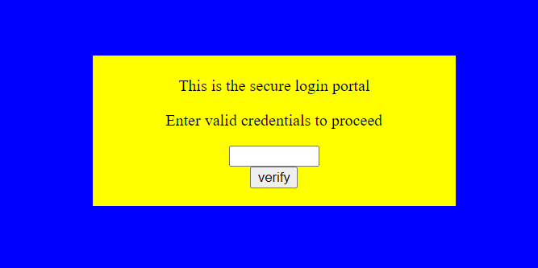

# PicoCTF Write-Up ( Web Exploitation )


<!--
Available Write Up : ~

PicoCTF 2019
PicoCTF 2021
picoMini by redpwn
PicoCTF 2022
PicoCTF 2023
PicoCTF 2024
-->

[**PicoCTF 2019 :**](#PicoCTF-2019) 
- [**dont-use-client-side**](#dont-use-client-side)
- [**logon**](#plogon)
- [**Insp3ct0r**](#pinsp3ct0r)
- [**where are the robots**](#pwhere-are-the-robots)

[**PicoCTF 2021 :**](#picoctf-2021)
- [**cookies**](#cookies)
- [**Scavenger Hunt**](#scavenger-hunt)
- [**GET aHEAD**](#get-ahead)
- [**Who are you?**](#who-are-you?)
- [**More Cookies**](#more-cookies)
- [**It is my birthday**](#it-is-my-birthday)

[**picoMini by redpwn**](#picoMini-by-redpwn)
- [**caas**](#caas)
- [**login**](#login)

[**PicoCTF 2022**](#picoctf-2022)
- [**Local Authority**](#local-authority)
- [**Inspect HTML**](#inspect-html)
- [**Includes**](#includes)
- [**SQLiLite**](#sqlilite)
- [**SQL Direct**](#sql-direct)
- [**Secrets**](#secrets)
- [**Search Source**](#search-source)
- [**Roboto Sans**](#roboto-sans)
- [**Power Cookie**](#power-cookie)
- [**Forbidden Paths**](#forbidden-paths)

[**PicoCTF 2023**](#picoctf-2023)
- [**SOAP**](#soap)
- [**More SQLi**](#more-sqli)
- [**MatchTheRegex**](#match-the-regex)
- [**findme**](#findme)

[**PicoCTF 2024**](#picoctf-2024)
- [**WebDecode**](#webdecode)
- [**Unminify**](#unminify)
- [**IntroToBurp**](#intro-to-burp)
- [**Bookmarklet**](#bookmarklet)
- [**Trickster**](#trickster)

## PicoCTF 2019
- ### dont-use-client-side

This Task provide us with [url](https://jupiter.challenges.picoctf.org/problem/37821/) Shown a secure login portal



Try to bypass with ``admin' or '1'='1`` but it shows ``Incorrect password``

Found an interesting Code 

```
<script type="text/javascript">
  function verify() {
    checkpass = document.getElementById("pass").value;
    split = 4;
    if (checkpass.substring(0, split) == 'pico') {
      if (checkpass.substring(split*6, split*7) == 'a3c8') {
        if (checkpass.substring(split, split*2) == 'CTF{') {
         if (checkpass.substring(split*4, split*5) == 'ts_p') {
          if (checkpass.substring(split*3, split*4) == 'lien') {
            if (checkpass.substring(split*5, split*6) == 'lz_1') {
              if (checkpass.substring(split*2, split*3) == 'no_c') {
                if (checkpass.substring(split*7, split*8) == '9}') {
                  alert("Password Verified")
                  }
                }
              }
      
            }
          }
        }
      }
    }
    else {
      alert("Incorrect password");
    }
    
</script>
```
Seeing ``pico`` and ``CTF{`` assuming this is the flag now lets analyze the code.

we can see that the password is being checked in a series of conditions. The password input is broken into multiple parts using the ``substring()`` function, which extracts specific parts of the string, and then compares them to hardcoded values.

The value of ``split`` is set to ``4``, meaning the password is divided into chunks of 4 characters for validation.

the ``verify`` function check password in parts :

1. First 4 Characthers (index 0-4)
- The condition ``checkpass.substring(0, split) == 'pico'`` tells us that the first 4 characters of the password must be ``'pico'``

2. Characters at index 24-28 (6th chunk):

- The condition ``checkpass.substring(split*6, split*7) == 'a3c8'`` checks that the 6th chunk of the password (characters 24-28) must be ``'a3c8'``.

3. Characters at index 4-8 (2nd chunk):

- The condition ``checkpass.substring(split, split*2) == 'CTF{'`` checks that the 2nd chunk of the password (characters 4-8) must be ``'CTF{'``.

4. Characters at index 16-20 (5th chunk):

- The condition ``checkpass.substring(split*4, split*5) == 'ts_p'`` checks that the 5th chunk of the password (characters 16-20) must be ``'ts_p'``.

5. Characters at index 12-16 (4th chunk):

- The condition ``checkpass.substring(split*3, split*4) == 'lien'`` checks that the 4th chunk of the password (characters 12-16) must be ``'lien'``.

6. Characters at index 20-24 (6th chunk):

- The condition ``checkpass.substring(split*5, split*6) == 'lz_1``' checks that the 6th chunk of the password (characters 20-24) must be ``'lz_1'``.

7. Characters at index 8-12 (3rd chunk):

- The condition ``checkpass.substring(split*2, split*3) == 'no_c'`` checks that the 3rd chunk of the password (characters 8-12) must be ``'no_c'``.

8. Last 4 characters (index 28-32):

- The condition ``checkpass.substring(split*7, split*8) == '9}'`` checks that the last chunk of the password (characters 28-32) must be ``'9}'``.

From the conditions we can arrange the password in order from ``0-4`` to ``4-8``and so on then we will get the flag goes like this 

```picoCTF{no_clients_plz_1a3c89}```
